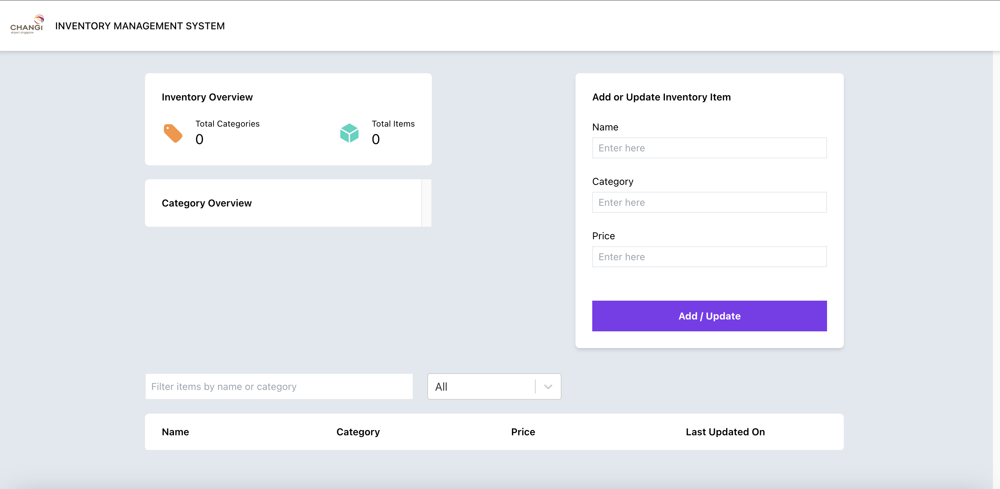

# CAG Inventory Management System

## Summary

Frontend Application: React, TypeScript, Tailwind, React Query, React Select

Backend Application: Node.JS, Sequelize (ORM Mapping), MySQL

I've completed all backend tasks listed and you may use the following API endpoints to test:

1. Backend Task 1 - Insert/Update a new item

   > POST http://localhost:8080/items

2. Backend Task 2 - Get items within date range

   > POST http://localhost:8080/items/search

3. Backend Task 3 - Get aggregated data in a category

   > POST http://localhost:8080/items/search

4. Backend Bonus Task - Advanced search with filters, pagination and sorting options

   > POST http://localhost:8080/items/search

## Getting Started

### mySQL Set up

1. Start a local mySQL instance

2. Connect to the local instance with username: **root with no password needed** using your database design tool of choice (e.g mySQL Workbench) or CLI

3. Create new database schema titled **inventorydb**

### Setting up Frontend and Backend Code

1. Git clone the repository with this [link](https://github.com/marcushojww/cag-inventory-management-system.git)
2. Let's start getting our backend code up with the following terminal commands in sequence:

   `cd backend`

   `npm install`

   `npm start`

3. Now let's open a new terminal, and head over to the root directory and get our frontend code up with the following commands in sequence:

   `cd frontend`

   `npm install`

   `npm start`

4. Now, you should be able to see the frontend UI on your browser at [localhost:3000](http://localhost:3000)

   

5. You may now populate the items via POSTMAN or using the React form!

## Testing (Backend)

You may run the unit tests via the following command after entering the backend folder:

`npm test`

## Improvements

### Backend

1. Given more time, I would run the database locally with Docker with Dockerfile and docker.compose.yaml. I would also explore deploying the code with AWS.

2. Currently, the unit test cases do not cover every API I've created to support the Frontend app and the Backend functions required from the assignment.

### Frontend

1. Currently, the UI is catered to Desktop view and is not responsive.
